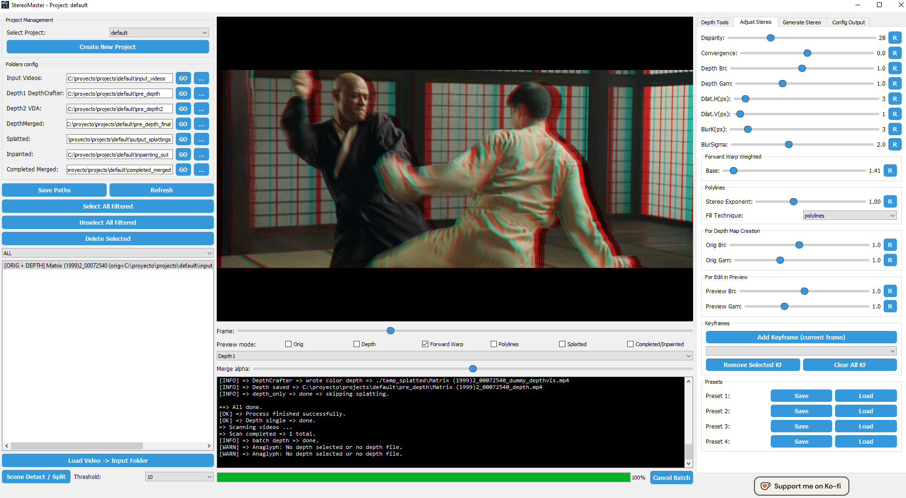

# StereoMaster

**StereoMaster** is a GUI application for converting 2D videos into impressive 3D content using AI. It combines:
- [DepthCrafter](https://huggingface.co/tencent/DepthCrafter)  
- [Video Depth Anything](https://huggingface.co/depth-anything/Video-Depth-Anything)  
- [StereoCrafter](https://huggingface.co/TencentARC/StereoCrafter)


## 📣 News
- `2025/02/09` Initial commit.
- `2025/02/16` Update: Added downscale inpainting, anaglyph file merging, enhanced partial frames, improved StereoCrafter (mask dilation, blur, configurable chunking), refined color matcher (fixed preview vs. SBS mismatch), new outputs (4KHSBS, Right-Only, EXR export), plus various bug fixes.
- `2025/02/28` Early Blackwell support, improved color matching in inpainting, new mixed inpainting system, fixed missing frames and repeated frames at the end of each chunk, UI/UX enhancements, VDA split fix for batch_size, and improved installation process.


## Features

- **Depth map generation** using DepthCrafter or Video Depth Anything.
- **Splatting** (stereo shift) and **filling** (inpainting) with StereoCrafter.
- **User-friendly GUI** with:
  - Dynamic adjustments for disparity, convergence, and depth parameters.
  - Keyframes to modify 3D intensity over time.
  - Multiple preview modes (Original, Depth, Anaglyph, etc.).
  - Scene detection and merging of clips for longer videos.


## System Requirements

- **OS:** Windows 10/11 (64-bit)  
- **GPU:** NVIDIA (RTX 3000/4000/*5000*)  
  - **Required VRAM:** 12 GB (16 GB recommended)   
- **Python:** 3.12  
- **Git:** Required for dependency management  


## Two Versions of Requirements

1. **CUDA 12.6 (Stable)**  
   - Use `requirements_cu126.txt` for standard RTX GPUs.  
   - Torch versions are stable releases.

2. **CUDA 12.8 (Nightly) for Blackwell**  
   - Use `requirements_cu128.txt` if you want to run on the latest NVIDIA Blackwell (RTX 5000 series).  
   - Torch is installed from nightly builds; there is no official xformers wheel yet.

---

## Installation Guide (Python 3.12 & CUDA 12.6)

> **Note:** After you **complete all these steps**, you can **automatically launch StereoMaster** by double-clicking the file **`Launch StereoMaster.bat`** in the repository’s root folder.

---

### 1. Install Python 3.12.8

1. Download here:  
   [Python 3.12.8 (64-bit) for Windows](https://www.python.org/ftp/python/3.12.8/python-3.12.8-amd64.exe)

2. Run the installer and **check** the box **“Add Python to PATH.”**

3. Click **Customize Installation** and enable:
    - Install pip  
    - Install venv  

4. Click **Next** → **Install** → **Finish**.

5. Open **CMD** (Win + R → type `cmd` → press Enter) and run:

    ```
    python --version
    ```

   You should see:
   
    ```
    Python 3.12.8
    ```

---

### 2. Remove Microsoft Store Python (If Present)

Windows sometimes has a placeholder Python alias in `WindowsApps` that can interfere with the real Python installation.  
Delete it with:

    del C:\Users\%USERNAME%\AppData\Local\Microsoft\WindowsApps\python.exe

Then verify again:

    where python

Ensure it points to the real Python installation

---


### 3. Install Git

1. Download from:  
   [Git for Windows](https://git-scm.com/download/win)

2. Run the installer (accepting the default options is usually fine).


---	


### 4. Clone the StereoMaster Repository

    cd C:\
    git clone https://github.com/murdavs/StereoMaster.git
    cd StereoMaster

---

### 5. Create a Virtual Environment & Install Dependencies

1. Create a new virtual environment:

       python -m venv stereomaster_env

2. Activate it:

       call stereomaster_env\Scripts\activate

3. Upgrade pip:

       pip install --upgrade pip setuptools wheel


4.  **Choose** the requirements file you need:

- For standard (CUDA 12.6 stable):  
  ```
  pip install --use-pep517 --no-cache-dir -r requirements_cu126.txt
  ```

- For Blackwell (CUDA 12.8 nightly):  
  ```
  pip install --use-pep517 --no-cache-dir -r requirements_cu128.txt
  ```

(Torch with CUDA 12.8 is installed from nightly builds, and xformers is not yet available for that combination.)


**Verify PyTorch & CUDA**:

    python -c "import torch; print(torch.__version__); print(torch.cuda.is_available())"

Expected:

    2.6.0
    True

---


### 6. Login in Hugging Face CLI & Download Model Weights

1. Login in Hugging Face CLI:

       
       huggingface-cli login

   > Get your token here: [Hugging Face Token Settings](https://huggingface.co/settings/tokens)

2. Clone the required models into a `weights` folder:

       cd C:\StereoMaster
       mkdir weights
       cd weights
       git clone https://huggingface.co/stabilityai/stable-video-diffusion-img2vid-xt-1-1
       git clone https://huggingface.co/tencent/DepthCrafter
       git clone https://huggingface.co/TencentARC/StereoCrafter

3. Download depth models:

       cd C:\StereoMaster
       mkdir checkpoints
	   cd checkpoints
       curl -k -L -o video_depth_anything_vits.pth https://huggingface.co/depth-anything/Video-Depth-Anything-Small/resolve/main/video_depth_anything_vits.pth
       curl -k -L -o video_depth_anything_vitl.pth https://huggingface.co/depth-anything/Video-Depth-Anything-Large/resolve/main/video_depth_anything_vitl.pth

---

## Launch StereoMaster

After **all steps** are completed:

1. Go to the root folder of StereoMaster:

       cd C:\StereoMaster

2. Activate the virtual environment:

       call stereomaster_env\Scripts\activate

3. Run the script:

       python StereoMaster.py

4. **Alternatively**, **double-click**:
   **`Launch StereoMaster.bat`** (in the root directory) to launch automatically.

---

## Ko-fi Support

[](https://ko-fi.com/3dultraenhancer)

If you find StereoMaster helpful or would like to support further development, consider [buying me a coffee](https://ko-fi.com/3dultraenhancer)). Thank you!

---

## License

Provided “as is.” Use at your own risk; no warranty is given for potential data loss or system problems.

---

## Screenshot

Below is a sample image of **StereoMaster** in action:




